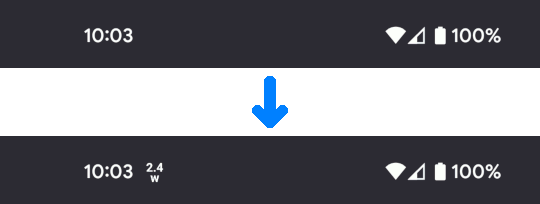
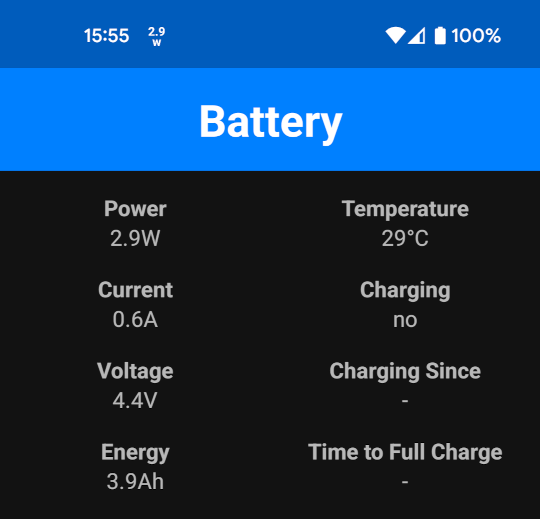

# wattz

*wattz* is a simple battery power indicator for your Android device's status bar,
showing the number of watts coming out of, or going into, the battery. Opening
the app also shows additional detailed battery metrics.

**status bar**

**app view**

