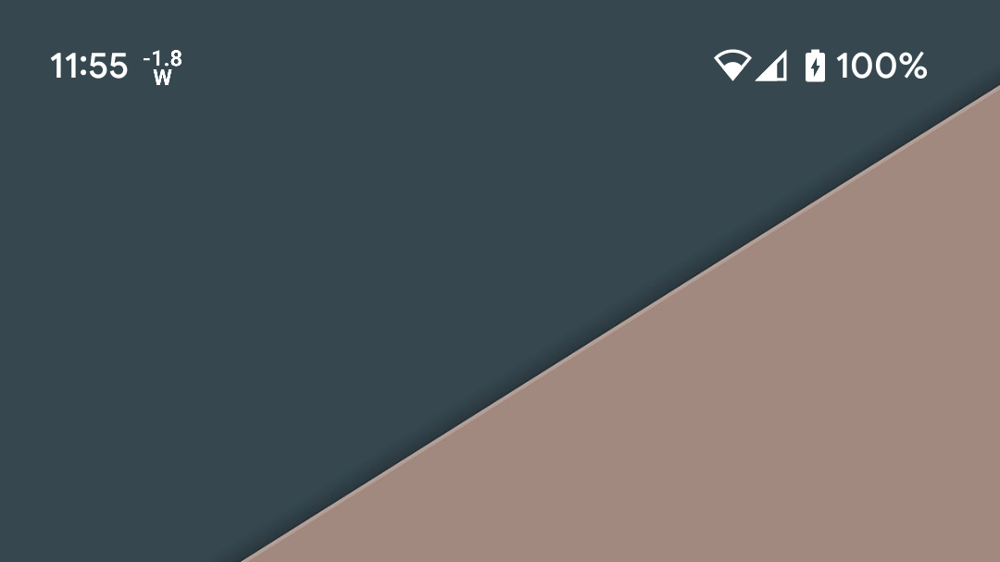
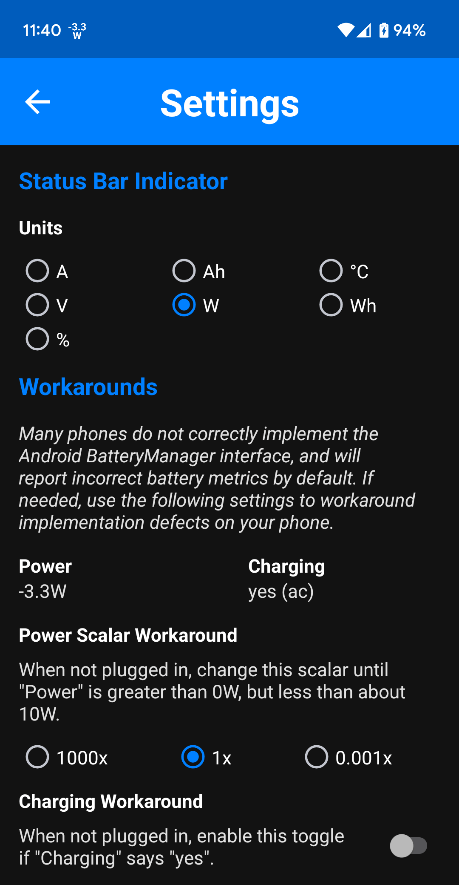

# Wattz

*Wattz* is a simple battery indicator. It shows one of several real time battery
metrics right in your status bar. Open the app to see detailed battery metrics
and and edit your settings.

Notification permissions are required to show the indicator in the status bar.
Please open the app once to automatically start the indicator service.

This app respects your privacy!
* No unnecessary permissions
* No ads
* No collection of user data of any kind
* No sharing data with third parties

Detailed battery metrics include:
* Power (watts)
* Current (amps)
* Voltage (volts)
* Energy Level (watt-hours and amp-hours)
* Temperature (celsius)
* Charge Level (percent)
* Is Charging (yes/no)
* Charging Since (date/time)
* Time to Full Charge (duration)

## Screenshots

**Status Bar**

**App View**

**Settings View**

## FAQ

1. Why does my phone always show `0W`?

    Many phones, especially Samsungs, don't follow the BatteryManager spec. Try changing "Power Scalar Workaround" in the settings view.

2. Why does my external power meter show different power numbers than *Wattz*?

    Wattz can only measure power coming into or out of the battery management system. Your external meter is measuring this plus any power your phone is using in addition to that.

3. Why isn't the indicator showing up in my status bar?

    *Wattz* needs notification permissions on newer Android phones in order to show the indicator. Make sure to open *Wattz* at least once, where it should prompt you to grant it permissions. Otherwise, check the Android app settings to ensure *Wattz* has notification permissions.

   Keep in mind, Android can revoke these permissions at any time without telling you, so you may need to re-enable them periodically.
